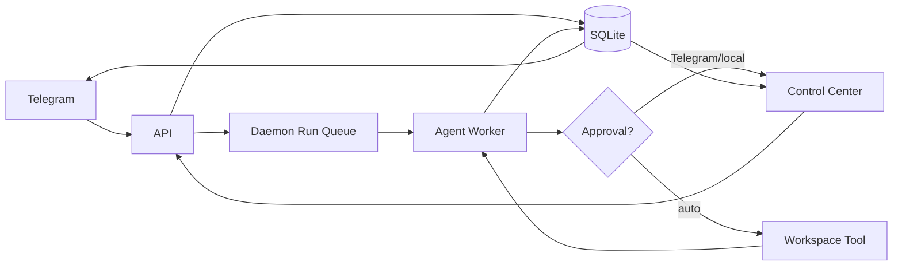

# OpenFrost — AI Operating System

## Project Specification (MVP, v1)

**Status:** Confirmed · **Audience:** Power users · **Platform:** Windows-first
**Team:** 4 (1 leader + 3 members) · **Working name:** `openfrost`

---

## 1. Vision

OpenFrost is a **personal AI operating system** that turns a user's own PC into a
self-hosted AI workspace platform. Instead of "one chatbot," each workspace is an
isolated AI _app_ — with its own instructions, personality, memory, models, tools,
and permissions — much like an OS has different apps for different tasks.

The user controls everything locally. A **Telegram DM bot** is the full remote
interface, not a limited companion; the **local browser Control Center** is the
dashboard for management, approvals, and audit.

### MVP product definition

> One always-on, self-hosted AI OS on the user's PC, with isolated custom workspaces
> (Coding, Learning, General + custom), synced Telegram/web chats, persistent hybrid
> memory, and approval-gated real-PC tools.

### MVP demo acceptance (definition of done)

1. A user creates a Coding and a Learning workspace with different personalities.
2. They pair Telegram with a one-time code and send a message to the active workspace.
3. The chat appears instantly in the web dashboard (sync).
4. Each assistant remembers **only its own workspace's** context and memory.
5. A tool action (e.g., run command / write file) requests approval in the dashboard
   (and via Telegram buttons) and is approved or rejected.
6. The app restarts (daemon restart) without losing chats, workspaces, or memory.
7. A scheduled job runs, posts to Telegram + activity log, and a missed job is
   surfaced for approval at next login.

---

## 2. Roles

| Role                  | Owner    | Accountable for                                                      |
| --------------------- | -------- | -------------------------------------------------------------------- |
| **Leader**            | You      | Product, architecture, scope, integration, releases, backlog triage  |
| **Agent Runtime**     | Member 2 | Planning loop, tool execution, workspace policies, memory, providers |
| **Control Center UI** | Member 3 | Dashboard, approvals, activity timeline, workspace editor            |
| **Platform**          | Member 4 | Local data, secrets, auth, Telegram, scheduler, daemon/CLI, backups  |

---

## 3. Core decisions (confirmation log)

| Q                   | Decision                                                                                                                        |
| ------------------- | ------------------------------------------------------------------------------------------------------------------------------- |
| First user          | Power users / developers.                                                                                                       |
| Product identity    | Workspace-based AI OS; "different AI apps for different tasks."                                                                 |
| Self-hosting        | On the user's own PC first; Docker/VPS later.                                                                                   |
| Remote reach        | Telegram is a **full** remote interface (same power as the PC bot).                                                             |
| Primary interface   | Local browser Control Center at `http://localhost:<port>`.                                                                      |
| Workspace model     | Isolated AI profile: instructions, memory, chats, tools, permissions, local folder.                                             |
| PC control scope    | Local files, terminal commands, browser tasks — **within explicitly granted workspaces**. No screen/mouse/OS automation in MVP. |
| Model hosting       | Cloud models (OpenAI, Anthropic) via user's own API keys; architecture ready for local models later.                            |
| General context     | Sees **promoted summaries** from other workspaces, never raw chats/files.                                                       |
| Folder access       | User **explicitly selects** allowed roots per Coding workspace.                                                                 |
| Telegram approval   | Approve/reject directly in Telegram inline buttons; **high-risk** actions additionally require local Control Center approval.   |
| Telegram scope      | Paired **direct messages only**. No groups/public in MVP.                                                                       |
| First OS            | **Windows first.**                                                                                                              |
| Liveness            | **Always-on daemon** at sign-in; Telegram online whenever PC + daemon run. Uses **long polling** (no webhook).                  |
| Browser model       | One **AI OS-managed Chromium profile per workspace**; user signs in manually; assistant never handles passwords/2FA.            |
| High-risk baseline  | Delete/overwrite files, commands outside granted folders, new network destinations, credential changes, system-level commands.  |
| Providers           | OpenAI + Anthropic initially, **per-workspace override** over a global default.                                                 |
| Storage             | OpenClaw-style **hybrid**: SQLite state + editable Markdown workspace files.                                                    |
| Workspace subject   | Start from **template** (General/Learning/Coding/custom) then **toggle capabilities** + add **custom instructions**.            |
| Proactive work      | **User-created schedules only**; results → Telegram + activity log.                                                             |
| Memory              | Visible, editable workspace **Markdown summaries** saved automatically; user can promote facts to General.                      |
| Daemon lifecycle    | `openfrost onboard --install-daemon` registers a Windows **Scheduled Task** at sign-in; `start`/`stop`/`status` control it.     |
| Concurrency         | **One active run per workspace**; extra requests queue.                                                                         |
| Offline             | Pending Telegram messages processed on reconnect with a visible "delayed" notice.                                               |
| Conversations       | Multiple **named chats per workspace**; Telegram uses active one via `/new` and `/chats`.                                       |
| Terminal execution  | Runs as the signed-in Windows user (OpenClaw exec-style) within workspace-approved folder roots, recorded + approval-gated.     |
| Secrets             | Encrypted with Windows **DPAPI / Credential Manager**; decrypted only for the signed-in owner.                                  |
| Missed schedules    | Stay **pending**; user approves/skips at next login via Telegram buttons (also recorded).                                       |
| Control Center auth | Local admin password/session by default; explicit dev-only no-auth option.                                                      |
| Backups             | Automatic encrypted local backups + `openfrost backup create` / `restore`.                                                      |
| Extensibility       | Fixed core tools only in MVP. No plugin marketplace / user-written tools yet.                                                   |

---

## 4. Architecture & stack

**All TypeScript.** Node.js LTS monorepo (pnpm workspaces). Self-contained local
services — **no Docker for the MVP runtime**, no external DB servers.

```text
apps/
  web/        Next.js Control Center (React), local-only
  api/        Fastify API + WebSocket/SSE for realtime chat/events/approvals
  telegram/   grammY Telegram bot, long polling, pairing, inline approvals
  daemon/     Scheduler (node-cron) + background jobs + run queue
packages/
  db/         better-sqlite3 + Drizzle ORM, migrations, seed templates
  domain/     Shared Zod schemas + TS contracts for all entities/events
  agent/      AI SDK agent loop, providers, tools, workspace policies, memory
  cli/        `openfrost` CLI (commander) — onboard/start/stop/status/backup
  ui/         Shared React components (primitive + workflow components)
infra/
  installer.ps1   PowerShell installer (checks Node LTS -> `openfrost onboard`)
  scheduled-task  Task Scheduler registration (sign-in trigger)
```

### Data flow



### Storage layout (confirmed hybrid)

```
%USERPROFILE%\.openfrost\            protected app state
  config.json                        settings (not secrets)
  secrets\                           DPAPI-encrypted (model keys, Telegram token)
  pairing\                           Telegram pairing + session state
  audit\                             event records
  db\openfrost.db                    SQLite: users, workspaces, conversations,
                                     messages, events, approvals, schedules, runs

%USERPROFILE%\OpenFrost\workspaces\<workspace>\
  instructions.md                    workspace rules + custom instructions
  persona.md                         personality / tone
  memory\*.md                        visible, editable, searchable memory
  notes.md                           user + assistant notes
  .allowed-folders                   explicitly granted project roots
  .browser\                          per-workspace managed Chromium profile
```

### Key components

- **Next.js App Router** — Control Center dashboard + workspace editor.
- **grammY** — TypeScript Telegram bot (long polling; inline approval buttons).
- **better-sqlite3 + Drizzle ORM** — typed local SQLite access, migrations.
- **Vercel AI SDK + Zod** — provider-agnostic agents, streaming, validated tool calls.
- **node-cron** — persistent schedules; SQLite-backed pending/missed job queue.
- **commander** — `openfrost` CLI + Scheduled Task daemon lifecycle.
- **Fastify + SSE/WebSocket** — realtime sync between Telegram and web.

---

## 5. Domain model (core entities)

- **User** — the signed-in owner; local auth session.
- **Workspace** — name, template, custom instructions, personality, model override,
  enabled capabilities (chat, memory, folders, terminal, managed browser, schedules),
  allowed folder roots, Telegram-allowed flag.
- **Conversation** — named thread within a workspace.
- **Message** — canonical record for both Telegram and web; channel + status + `is_delayed`.
- **Event** — immutable activity-log entry (decisions, actions, results, failures).
- **Approval** — pending action; source (auto/telegram/local), risk class, state, outcome.
- **Schedule** — user-created recurring job; pending/missed state.
- **AgentRun** — one active run per workspace; captures status + queued state.
- **MemoryRecord** — editable Markdown memory; `workspace` scope, `promoted` to General.

---

## 6. Security model (MVP)

- No autonomous shell access from Telegram; actions are gated.
- **Pairing:** one-time code generated in Control Center; only that Telegram account is allowed.
- **Permission classes:**
  - `auto` — safe reads & planning; no prompt.
  - `telegram` — writes/commands; approve via inline buttons (or dashboard).
  - `local` — **high-risk baseline** (see §3): must approve in Control Center even if Telegram-approved.
- **Secrets:** DPAPI/Credential Manager only; never in files, env-committed, logs, or memory.
- **Control Center:** local admin password/session required (dev-only no-auth flag).
- **Browser:** per-workspace isolated profile; manual sign-in; agent never handles passwords/2FA.
- **Folder boundary:** process restricted to workspace-approved roots.

---

## 7. MVP scope guardrails (explicitly OUT)

- No plugin marketplace / user-loaded custom tools.
- No screen/mouse/keyboard OS automation.
- No group/public Telegram bots.
- No cloud relay or external hosting dependency.
- No Docker or VPS target for the first release.
- No local model runtime yet (architecture-ready only).

---

## 8. Delivery: 4 two-week iterations

- **Iteration 0 — Foundations:** product, monorepo + CI, CLI/daemon, local data layer, domain schema, dashboard shell + auth, GitHub board.
- **Iteration 1 — Chats & Workspaces:** Telegram skeleton + pairing, workspace CRUD/templates, chat sync + realtime, chat UI, agent chat loop, memory.
- **Iteration 2 — Actions & Approvals:** tool execution core, approval inbox + flows, activity timeline, model overrides, concurrency.
- **Iteration 3 — Browser, Scheduler, Delivery:** managed browser, schedules + missed handling, offline queue, backup/restore, E2E demo, release.

See [`BACKLOG.md`](./BACKLOG.md) for the full import-ready GitHub issue list.
